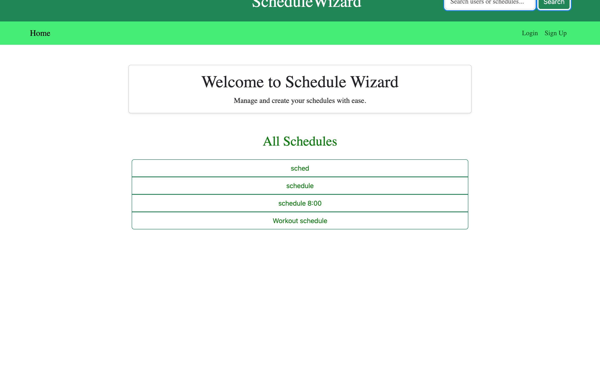

# Schedule-Wizard

ScheduleWizard is a web application that allows users to create and share schedules focused on various activities such as fitness, work, house chores, and social life. Users can also rate schedules created by others.

## Table of Contents
- [Installation](#installation)
- [Usage](#usage)
- [License](#License)
- [Contact](#contact)

## Installation
To set up this portfolio locally, please clone this repository, install necessary dependencies, and start run develop. 

## Usage
1. Open your browser and navigate to http://localhost:3000.
2. Sign up for a new account or log in if you already have one.
3. Create new schedules and view them on your profile.
4. Explore and rate schedules created by other users.

## License 
This project is licensed under the MIT License.

## Contact 

GitHub Profile: [bwolson31](https://github.com/bwolson31)

For additional questions, contact me via email: bwolson31@gmail.com

GitHub Profile: [Vineysha](https://github.com/Vineysha)

For additional questions, contact me via email: vineyshaolivo@gmail.com

GitHub Profile: [markhom] (https://github.com/markhom)

For additional questions, contact me via email: markhomchik4@gmail.com

GitHub Profile: [mhayes0022] (https://github.com/mhayes0022)

 For additional questions, contact me via email: mhayes0022@gmail.com

GitHub Profile: [AdelinM1] (https://github.com/AdelinM1)

For additional questions, contact me via email: marcusjorgensen@gmail.com

